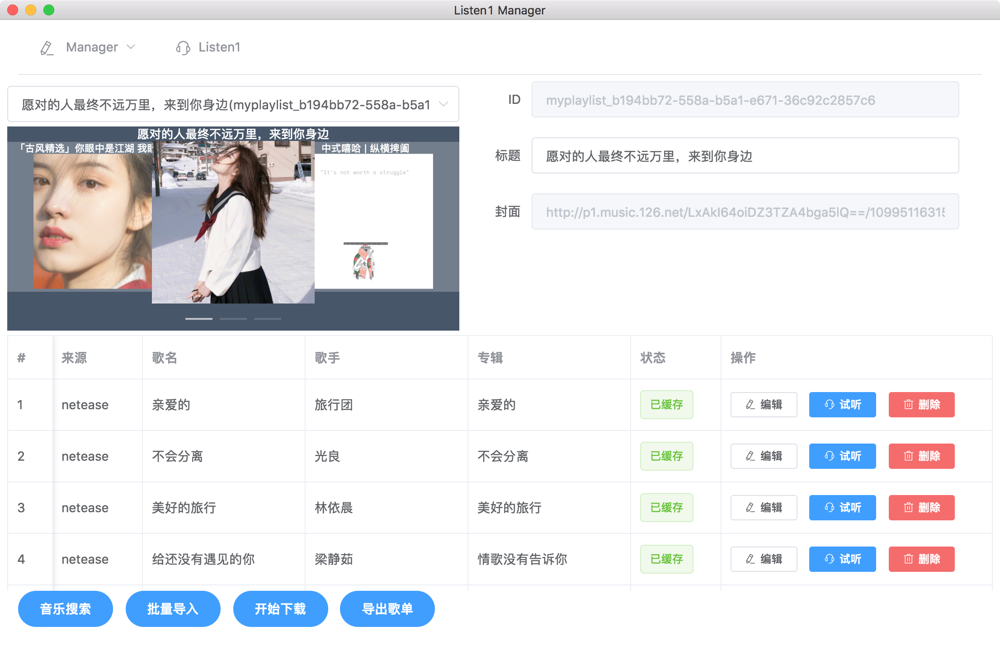

# listen1_manager

[](https://travis-ci.org/NoCLin/listen1_manager) [](https://ci.appveyor.com/project/NoCLin/listen1-manager)

listen1_manager是一个基于 [listen1_chrome_extension](https://github.com/listen1/listen1_chrome_extension) 开发的音乐管理软件，旨在提供更好的音乐体验。

你可以使用多个音乐平台的资源，制作自己的跨平台歌单。


(目前已包含网易云音乐，QQ音乐，虾米音乐接口，来源于listen1_chrome_extension项目，同时保留了原项目的所有功能)

## Preview

**主界面**
 


## Features

- Listen1 歌单管理(CRUD)

- ~~本地缓存~~
  
- 搜索结果整合

- 批量导入
    - 由歌单
    - 由专辑
    - 由歌手
    - 由歌名列表
  
- Listen1 Desktop整合

## Development

技术栈: Electron + Vue + vue-electron

```bash
git submodule update --init --recursive
yarn
yarn run build

```

## Changelog

**2018-02-26** 

[x] 接口简单测试、整理bugs

**2018-2-25**

[x] Vue-Electron重构

**2018-2-14**

[x] 基本功能实现

[TODOs](TODOs.md)

## License

[MIT](LICENSE)


